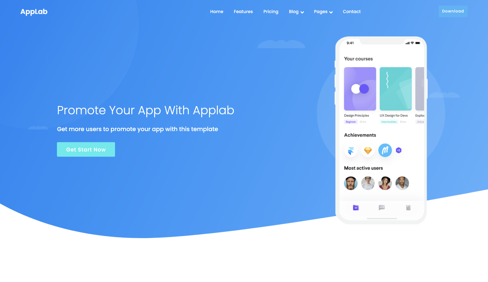

# devmentor.pl - HTML and CSS RWD: project based on design from [Colorlib.](https://colorlib.com/)

## Table of contents

- [Overview](#overview)
  - [The challenge](#the-challenge)
  - [Screenshot](#screenshot)
  - [Links](#links)
- [My process](#my-process)
  - [Built with](#built-with)
  - [What I learned](#what-i-learned)
  - [Useful resources](#useful-resources)
- [Author](#author)
- [Acknowledgments](#acknowledgments)

## Overview

### The challengels

Users should be able to:

- View the optimal layout for the site depending on their device's screen size

### Screenshot

### Links

- Solution URL: [See my code](https://github.com/axseinga/applab-landing-page)
- Live Site URL: [Check it out here](https://axseinga-applab-landing-page.netlify.app/)

## My process

### Built with

- Semantic HTML5 markup
- CSS custom properties
- SASS
- BEM pattern
- Flexbox
- CSS Grid
- Mobile-first workflow

### What I learned

This project allowed me to sharpen my skills in coding responsive websites and CSS. The goal was to code it fully without using Javascript. I started with mobile-first workflow however I left coding mobile navbar to the end of the project. The reason why has I encountered some difficulty with coding nav for mobile and desktop on the same HTML structure as it was my second time coding this. I added some useful links about building multi-level menus to #Useful resources. The other issue was showing and hiding the mobile menu without applying JS. I learned how to use the power of `checkbox` to display elements and make it more mobile-friendly instead of using pseudoclass `:hover`. I found a really good [article about CSS Click Events](http://tympanus.net/codrops/2012/12/17/css-click-events/) which shows how to imitate click events from Javascript. As well, I decided to structure my SASS however with this small project the SASS st5ructure is very minimal itself. To breathe a bit of life into the website I chose to animate the main image with pulse animation and style the buttons.

### Useful resources

- [SASS architecture](https://itnext.io/structuring-your-sass-projects-c8d41fa55ed4) - Article about structuring SASS.
- [CSS click events](http://tympanus.net/codrops/2012/12/17/css-click-events/) - How to imitate click events from JS in CSS.
- [CSS multi-levels dropdown menu article: 1](https://medium.com/swlh/building-a-css-only-responsive-multi-level-mega-menu-ee0a3781cc3f)
- [CSS multi-levels dropdown menu article: 2](https://w3bits.com/css-responsive-nav-menu/) -
- [6 Best Practices for Building Responsive Dropdown Menu](https://webdesign.tutsplus.com/articles/best-practices-for-responsive-dropdown-menus--cms-35212)
- [Font Awesome](https://fontawesome.com/) - I used Icons from Font Awesome for this project.
- [Pulse Effect Animation](https://www.florin-pop.com/blog/2019/03/css-pulse-effect/) - For the pulse effect animation, I got inspiration from Florin Pop's blog.
- [Stackoverflow: Why does flexbox stretch images?](https://stackoverflow.com/questions/37609642/why-does-flexbox-stretch-my-image-rather-than-retaining-aspect-ratio) - This thread helped me to maintain issues with the image of the logo.

## Author

- Github - [Axseinga](https://github.com/axseinga)
- Frontend Mentor - [@Axseinga](https://www.frontendmentor.io/profile/axseinga)
- LinkedIn - [@Agnieszka Urbanowicz](https://www.linkedin.com/in/agnieszka-urbanowicz-051147151/)

## Acknowledgments

Thanks to my [Mentor - devmentor.pl](https://devmentor.pl/) - for providing me with this task and for code review.
